# Space Project Management 🚀

A modern, project management application built with Laravel, Vue.js, and Inertia.js.  
Streamline your projects, collaborate with your team, and reach new heights in productivity.

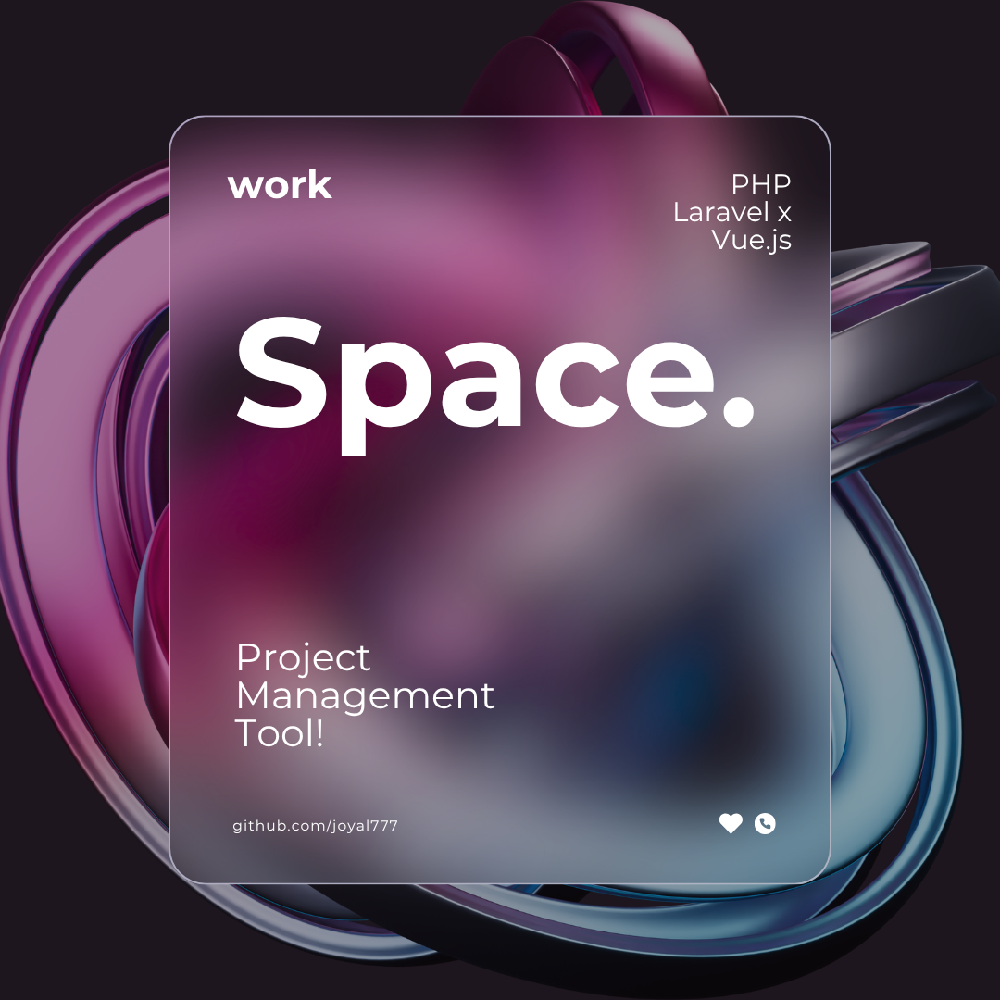

---

## Table of Contents

- [Tech Stack](#tech-stack)
- [Prerequisites](#prerequisites)
- [Quick Start](#quick-start)
- [Features](#features)
- [Project Structure](#project-structure)
- [Database Schema](#database-schema)
- [Customization](#customization)
- [Deployment](#deployment)
- [Contributing](#contributing)
- [License](#license)
- [Support](#support)
- [Next Steps & Future Enhancements](#next-steps--future-enhancements)

---

## Tech Stack

- **Backend:** Laravel 10.x
- **Frontend:** Vue.js 3 + Inertia.js
- **Styling:** Tailwind CSS
- **Database:** MySQL
- **Authentication:** Laravel Fortify

---

## Prerequisites

Before you begin, ensure you have:

- PHP 8.2 or higher
- Composer
- Node.js and npm
- MySQL
- Git

---

## Quick Start

1. **Clone the Repository**
    ```
    git clone https://github.com/joyal777/Space.git
    cd Space
    ```

2. **Install PHP Dependencies**
    ```
    composer install
    ```

3. **Install JavaScript Dependencies**
    ```
    npm install
    ```

4. **Environment Configuration**
    ```
    cp .env.example .env
    ```
    Edit `.env` with your database credentials:
    ```
    DB_CONNECTION=mysql
    DB_HOST=127.0.0.1
    DB_PORT=3306
    DB_DATABASE=space
    DB_USERNAME=your_mysql_username
    DB_PASSWORD=your_mysql_password
    ```

5. **Generate Application Key**
    ```
    php artisan key:generate
    ```

6. **Database Setup**
    - Create a database named `space`
    - Import or migrate:
        ```
        mysql -u your_username -p space < database/space.sql
        # Or manually create structure:
        php artisan migrate
        ```

7. **Build Frontend Assets**
    ```
    npm run dev    # For development
    npm run build  # For production
    ```

8. **Start Development Server**
    ```
    php artisan serve
    ```
    Visit [http://localhost:8000](http://localhost:8000) in your browser.

---

## Features

- ✅ **Project Management:** Create, organize, and track projects
- ✅ **Task Management:** Assign tasks with priorities and deadlines
- ✅ **Team Collaboration:** Invite team members to projects
- ✅ **Company Integration:** Register with or join companies
- ✅ **Real-time Dashboard:** Overview of projects and progress
- ✅ **Modern UI:** tailwind css 

---

- Upload files using Laravel's file storage system

### Styling Customization

- Modify Tailwind CSS theme in `tailwind.config.js`
- Add custom styles in `resources/css/app.css`

---

## Deployment

### Production Build

- php artisan config:cache
- php artisan route:cache
- php artisan view:cache
- npm run build


---

## Contributing

- Fork the repository
- Create your feature branch (`git checkout -b feature/AmazingFeature`)
- Commit your changes (`git commit -m 'Add AmazingFeature'`)
- Push to the branch (`git push origin feature/AmazingFeature`)
- Open a Pull Request

---

## License

This project is licensed under the MIT License - see the LICENSE file for details.

---

## Support

If you encounter any issues:

- Check the GitHub Issues tab
- Create a new issue with detailed description

---

## Next Steps & Future Enhancements

- **Image & Video Uploads:** Enhanced media management
- **Real-time Notifications:** Live updates for team activities
- **Advanced Reporting:** Project analytics and insights
- **Mobile App:** React Native companion app
- **API Development:** RESTful API for third-party integrations

---

### Good Luck & Happy Coding! 🚀


May your projects soar to new heights with Space Project Management!  
If you have any questions or need assistance, don't hesitate to reach out to the development team.

_Built with ❤️ using Laravel, Vue.js, and Inertia.js_

| 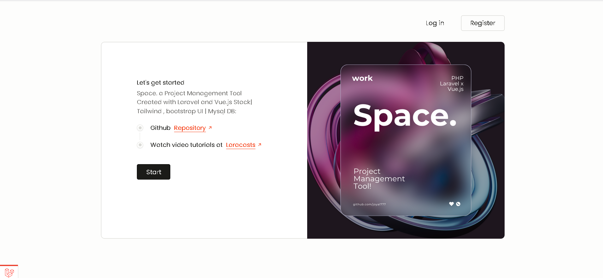 | 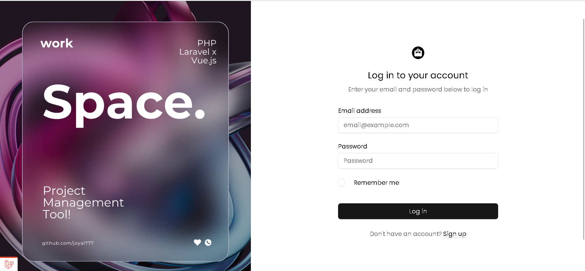 | 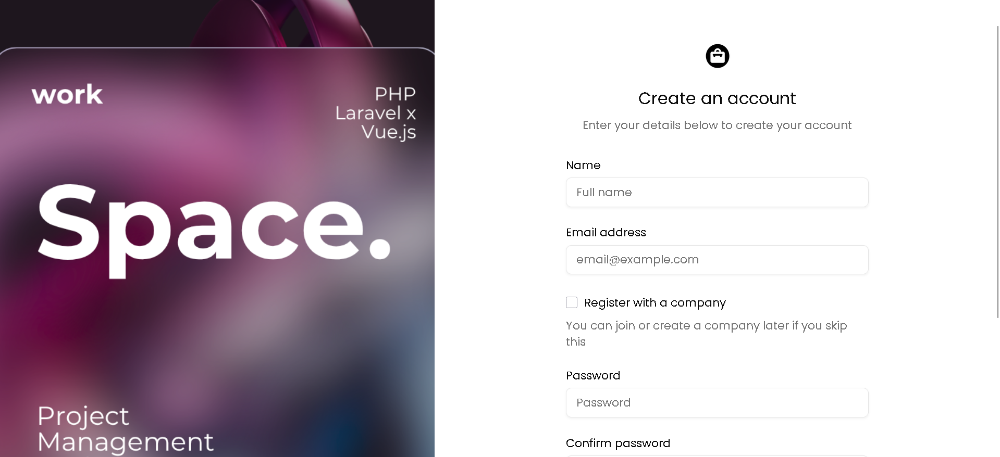 | 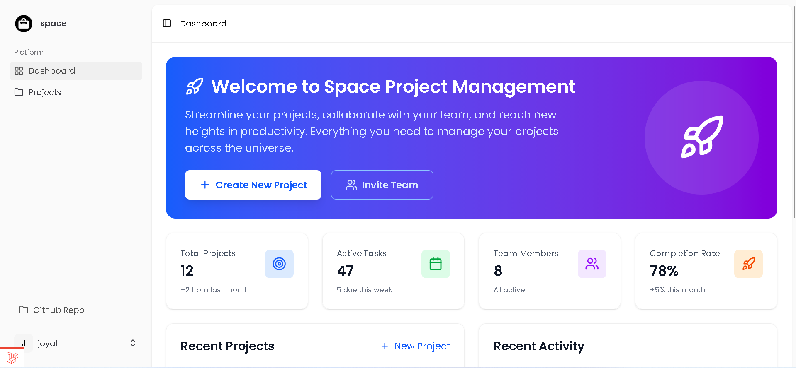 |
|----------------------------|-------------------------------|-------------------------------------|---------------------------------------|
| 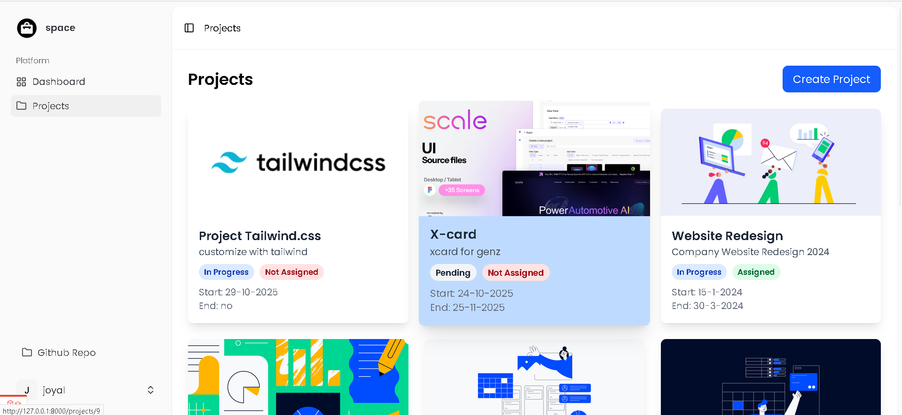 | 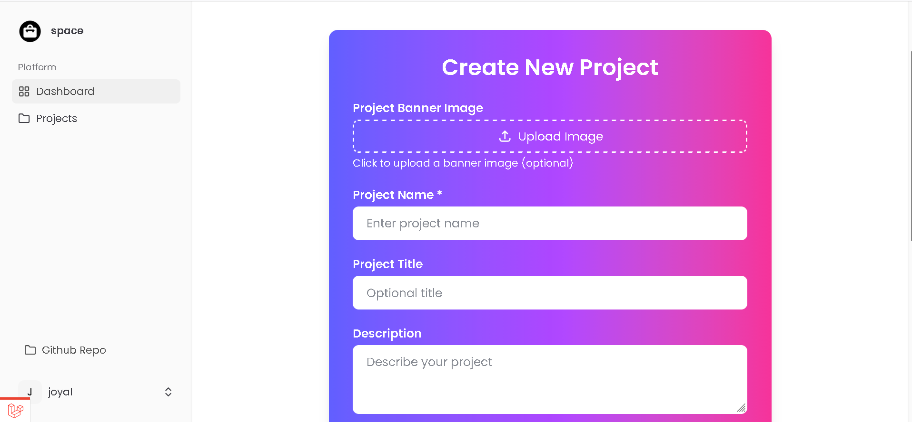 | 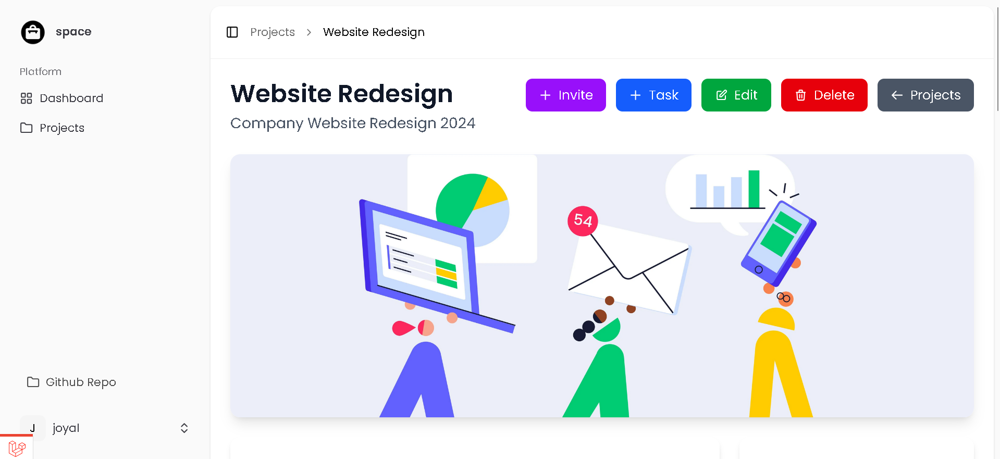 | 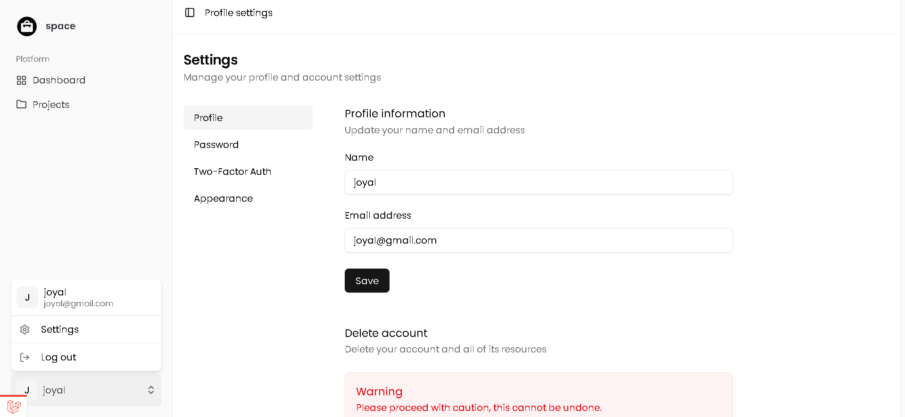 |
| 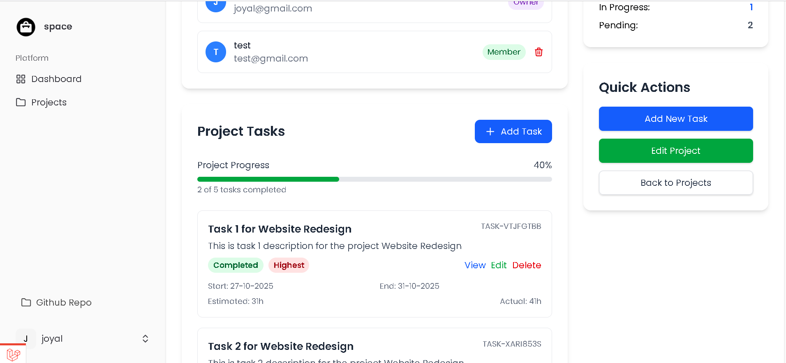 | 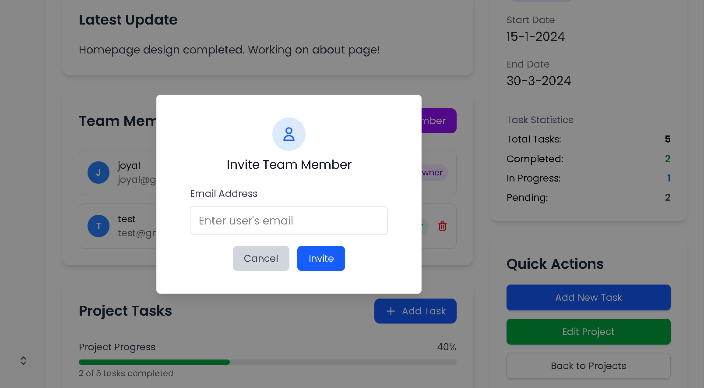 | 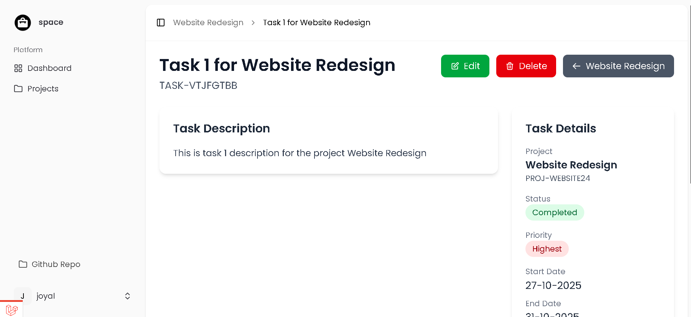 | 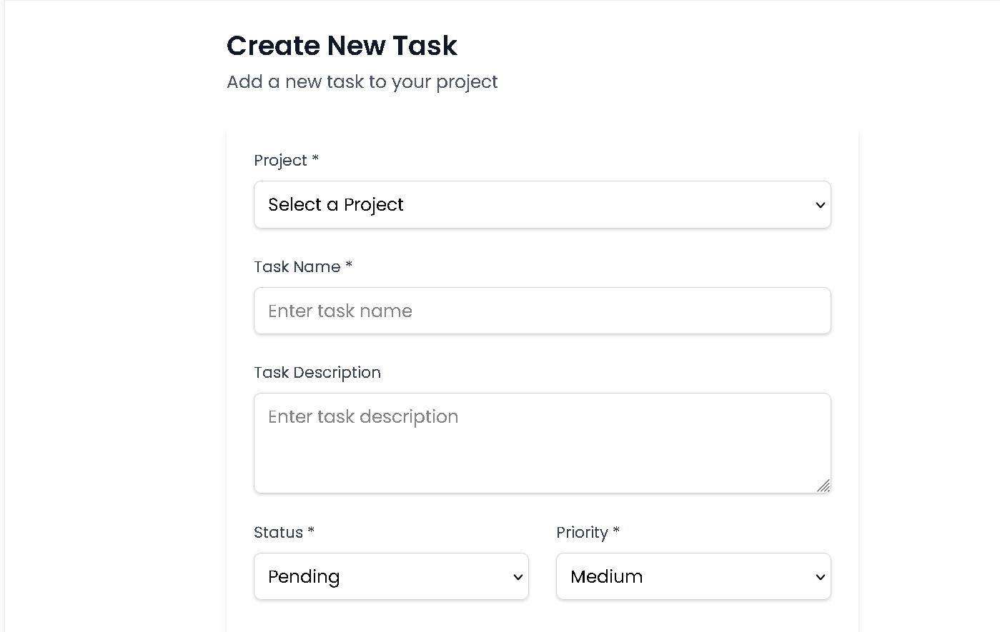 |


